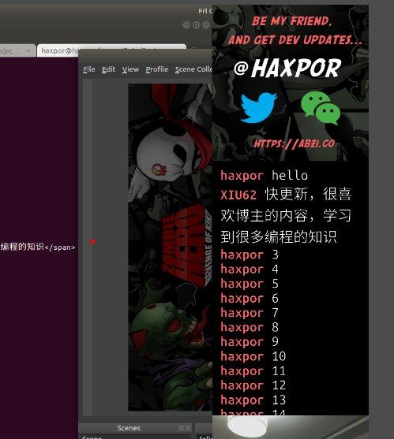

# douyu-chat-scrapper

It will help generating html file scrapping the last 20 (or configurable) messages from users included a streamer itself in the chatbox ready for OBS or other streaming application to consume via browser source.

# Steps To Make It Work

* `cd` to `backend/` directory
* `npm install`
* `DYC_ROOMID=... DYC_OUTPUT_HTML_PATH=... DYC_KEEP_NUM_MSG=... node index.js`
* Start your local web server and make sure the output generated .html file is accessible
* Configure OBS or other streaming application's browser source to point to such .html file as well as its `css/style.css` (if need to specify it separately; which is the case for OBS), also you need to set vertical scroll offset to the farthest.
* Now it should be working!

## OBS Configuration

When you add a browser source, set the following setting accordingly

* URL - point to your url accessing such generated HTML which is provided by your local server i.e. apache, nginx, etc
* Zoom - possibly you need to set maximum zoom level to be able to see chat text, in my case I need to set to `500`. I tried with set scaling to screen width like in normal showing HTML on mobile, but it doesn't work. Only setting Zoom level here works. Adjust the value according to what you see visually on OBS.
* Vertical Scroll - Set to it a certain high value like 100000. This will ensure it always show the latest chat message.
* Custom CSS - location to your CSS file. I recommended to also put it in a directory that web server can access it, although OBS seems to directly locate the file regarding whether it can access via local web server or not.

## Note

To put `index.html` and `css/` to be accessible by local web server, you might want to do a sym soft link. This depends on your case.

# Environment Variables

* `DYC_ROOMID` - `string` - define your room id as a streamer, you can easily check at your [Douyu account](https://mp.douyu.com/live/main). **Required**
* `DYC_OUTPUT_HTML_PATH` - `string` - define output path for generated HTML file to be consumed and configured at OBS or other streaming application
* `DYC_KEEP_NUM_MSG` - `string` - number of latest messages to be kept in the chatbox, messages outside of this range are not included in generated HTML file

# Screenshots

* Initially start

* After some users commented on it

# Behind The Scene
Generated HTML file is set to refresh every 3 seconds.
The program listens to incoming data over socket throuth `douyu` package, then process message before geneation of HTML file.

# Connect with our Devloper
Our founder and developer goes live for game development on Douyu from time to time, you can connect with him [here](https://www.douyu.com/6138951). Feel free to say hi!

# License
MIT, [ABZI.co](https://abzi.co)
