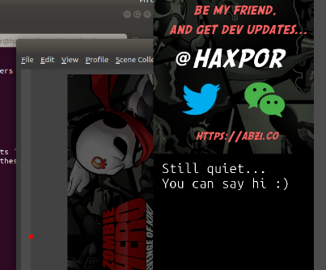

# douyu-chat-scrapper

It will help generating html file scrapping the last 20 (or configurable) messages from users included a streamer itself in the chatbox ready for OBS or other streaming application to consume via browser source.

# Steps To Make It Work

* `cd` to `backend/` directory
* `npm install`
* `DYC_ROOMID=... DYC_OUTPUT_HTML_PATH=... DYC_KEEP_NUM_MSG=... node index.js`
* Start your local web server and make sure the output generated .html file is accessible
* Configure OBS or other streaming application's browser source to point to such .html file as well as its `css/style.css` (if need to specify it separately; which is the case for OBS), also you need to set vertical scroll offset to the farthest.
* Now it should be working!

# Environment Variables

* `DYC_ROOMID` - `string` - define your room id as a streamer, you can easily check at your [Douyu account](https://mp.douyu.com/live/main). **Required**
* `DYC_OUTPUT_HTML_PATH` - `string` - define output path for generated HTML file to be consumed and configured at OBS or other streaming application
* `DYC_KEEP_NUM_MSG` - `string` - number of latest messages to be kept in the chatbox, messages outside of this range are not included in generated HTML file

# Screenshots

* Initially start

* After some users commented on it

# Behind The Scene
Generated HTML file is set to refresh every 3 seconds.
The program listens to incoming data over socket throuth `douyu` package, then process message before geneation of HTML file.

# License
MIT, [ABZI.co](https://abzi.co)
